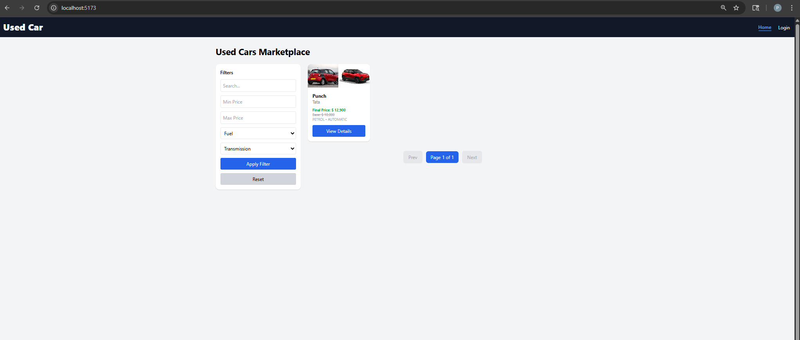
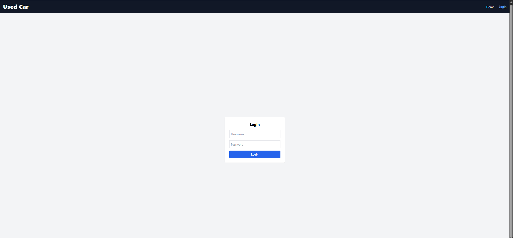
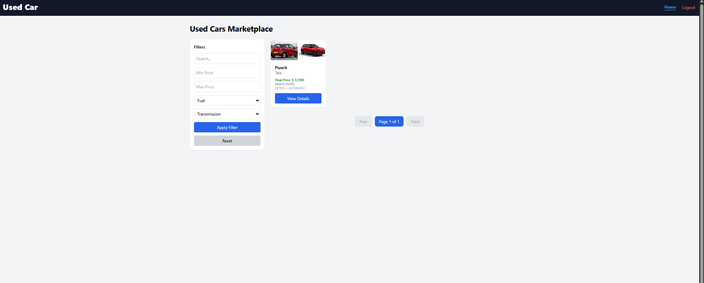
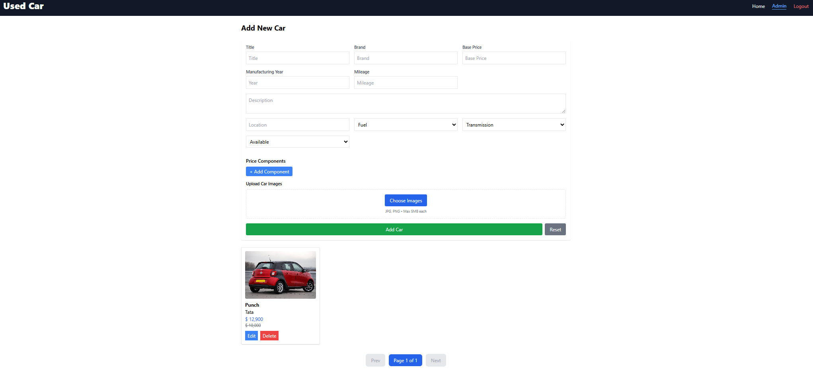

\# Used Car Application

\# Used Car E-Commerce Application (SPA)

\## Overview

This project is a \*\*Full Stack Used Car E-Commerce SPA\*\* built as part of a technical assignment.
It allows users to browse, search, and view car listings, while admins can manage listings.
The system is designed with focus on:

\* Security

\* Scalability

\* Clean architecture

\* Maintainability

As required in the assignment 
\---
\#  Tech Stack

\## Backend
\* Java + Spring Boot

\* Spring Data JPA

\* MySQL

\* JWT Authentication (Role-based)

\## Frontend

\* React

\* Tailwind CSS

\* Axios (API communication)

\---

\# Project Structure

```
used-car-app/
│
├── used\_car\_service/     # Backend (Spring Boot)
├── used\_car\_frontend/    # Frontend (React)
│
├── README.md
├── docker-compose.yaml
└── .gitignore

```

\---

\# Setup \& Run Instructions
\## 1. Clone Repository
```
git clone https://github.com/pradeepgitsource/used-car-app.git
cd used-car-app

```
\---

\## 2. Run With Docker
```
docker-compose up --build

Access:
\* Frontend → http://localhost:5173
\* Backend → http://localhost:8080
\* MySQL → localhost:3306
\---

\## 2. Run Backend (Spring Boot)
```
cd used\_car\_service
mvn clean install
mvn spring-boot:run
```
\### Backend runs on:
```
http://localhost:8080

```
\---

\## 3. Run Frontend (React)
```

cd used\_car\_frontend
npm install
npm run dev

```
\### Frontend runs on:

```
http://localhost:5173

```
\---


```
\---
\#  Features
\##  User (Buyer)

\* Browse car listings

\* Search by brand, model, location

\* Filter (price, fuel type, year, mileage, transmission)

\* Sort (price, year, mileage)

\* View car details

\## Admin

\* Add car

\* Update car

\* Delete car

\* Manage price components

\---

\# Price Calculation

Final price is dynamically calculated:

```

Final Price = Base Price 

&#x20;           + Additions (fixed / %)

&#x20;           - Deductions (fixed / %)

```
\---

\#  Assumptions

\* Users are divided into \*\*ADMIN and BUYER roles\*\*

\* Authentication is handled using \*\*JWT tokens\*\*

\* Images are stored as \*\*URLs (not file storage)\*\*

\* Default car status = `AVAILABLE`

\* Price components are optional

\* Validation is handled at service level

\* Pagination is implemented for scalability

\---

\#  Design Decisions

\##  Backend

\* Used \*\*Service Layer pattern\*\* for business logic separation

\* Implemented \*\*Specification pattern\*\* for dynamic filtering

\* DTO-based architecture to avoid exposing entities

\* Exception handling via custom exceptions

\* JWT authentication for secure APIs

\##  Frontend

\* Component-based architecture

\* Axios for API abstraction

\* Tailwind for responsive UI

\* State managed using React hooks


\---


\#  Scalability Considerations


\* Pagination for large datasets

\* Dynamic filtering via JPA Specification

\* Stateless authentication (JWT)

\* Modular architecture for easy extension

\---

\# Limitations / Future Improvements

\* Image upload can be enhanced using cloud storage (AWS S3)

\* Add refresh token mechanism

\* Add caching (Redis)

\* Improve UI/UX animations

\* Add unit + integration test coverage

\* Dockerize application

\---

\# 📸 Screenshots

Home Page Guest User

Car Details Page:

Login Page:

User View Page:

Admin View Page



\---

\#  API Documentation

(Optional – Swagger/Postman collection can be added)

\---

\#  Author
Pradeep Pathak


\---


\#  Notes


This project was built as part of a \*\*technical assignment\*\* focusing on clean architecture, performance, and real-world practices 


